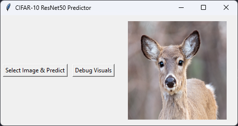
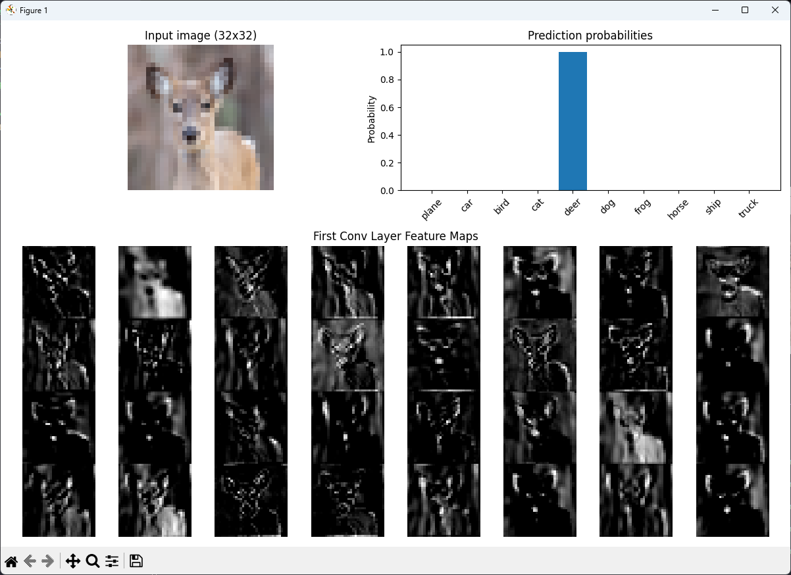

# CIFAR-10 ResNet50


---

## Overview

**CIFAR-10 ResNet50** is an image classification project showcasing the power of deep residual networks (**ResNet50**) applied to the **CIFAR-10 dataset**.
The model achieves **95.30% accuracy** on the test set thanks to transfer learning from a pre-trained checkpoint.

Key highlights:

* Deep residual network (**ResNet50**) adapted for CIFAR-10.
* Accuracy of **95.30%** on test set.
* Pre-trained weights sourced from a Kaggle dataset (due to limited compute resources).
* Clean, modular project structure for easy reuse.

---

## The CIFAR-10 ResNet50 Online

Want to see the CIFAR-10 image classification in action?

You can **upload your own images** and the model will predict what classe of image it is in real-time. It even shows:

* The **probabilities for each classe**
* The **processed input image**
* The **feature maps** from the first convolutional layer

Check it out here: [https://aitaneuh-cifar10-resnet50.streamlit.app/](https://aitaneuh-cifar10-resnet50.streamlit.app/)

---

## Pre-trained Model

Since training a ResNet50 on CIFAR-10 is computationally expensive, this project uses pre-trained weights.

* **ResNet50 Trained Model:** [Kaggle Dataset](https://www.kaggle.com/datasets/firuzjuraev/trained-models-for-cifar10-dataset)
* **ResNet Implementation:** [kuangliu/pytorch-cifar](https://github.com/kuangliu/pytorch-cifar/blob/master/models/resnet.py)

---

## Project Structure

```text
├── model.py         # ResNet50 architecture (adapted for CIFAR-10)
├── app.py           # Streamlit app
├── main.py          # Script to try the CIFAR-10 model with our own images
├── images/          # Images and graphs
├── samples/         # CIFAR-10 samples
└── README.md
```

---

## Features

### Classification on CIFAR-10

* Input: **32x32 RGB images**.
* Output: Predicted class (airplane, car, bird, cat, deer, dog, frog, horse, ship, truck).

### Pre-trained Model Usage

* Load a **ResNet50 checkpoint** with `torch.load(map_location="cpu")`.
* Evaluate model directly without expensive retraining.

---

## Results & Visualizations

### Tkinter GUI Screenshot



### Example Predictions



---

## Learning Outcomes

By exploring this project, you will understand:

* How to adapt **ResNet architectures** to CIFAR-10.
* How to load and try **pre-trained models** in PyTorch.
* The trade-offs between **training from scratch** vs. **using checkpoints**.
* How ResNet’s **skip connections** help train very deep networks.

---

## Installation

```bash
git clone https://github.com/Aitaneuh/cifar10-resnet50.git
cd cifar10-resnet50
pip install -r requirements.txt
```

### Run Evaluation with Pre-trained Model

```bash
python main.py
```

---

## Sources

* [Kaggle CIFAR-10 Trained Models](https://www.kaggle.com/datasets/firuzjuraev/trained-models-for-cifar10-dataset)
* [ResNet Model File (kuangliu)](https://github.com/kuangliu/pytorch-cifar/blob/master/models/resnet.py)

---
